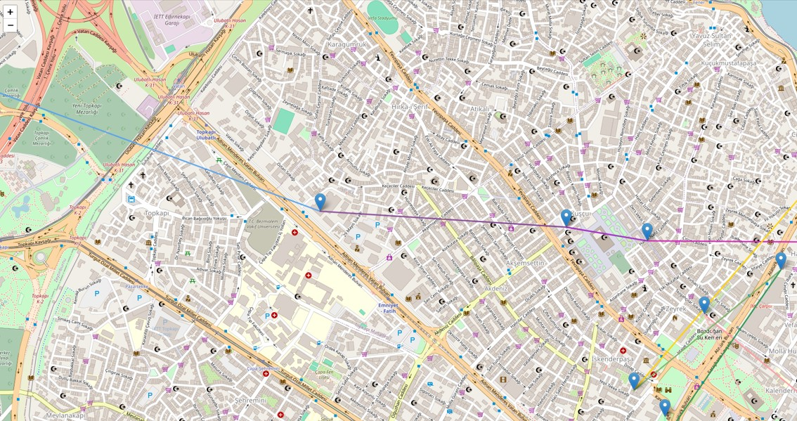
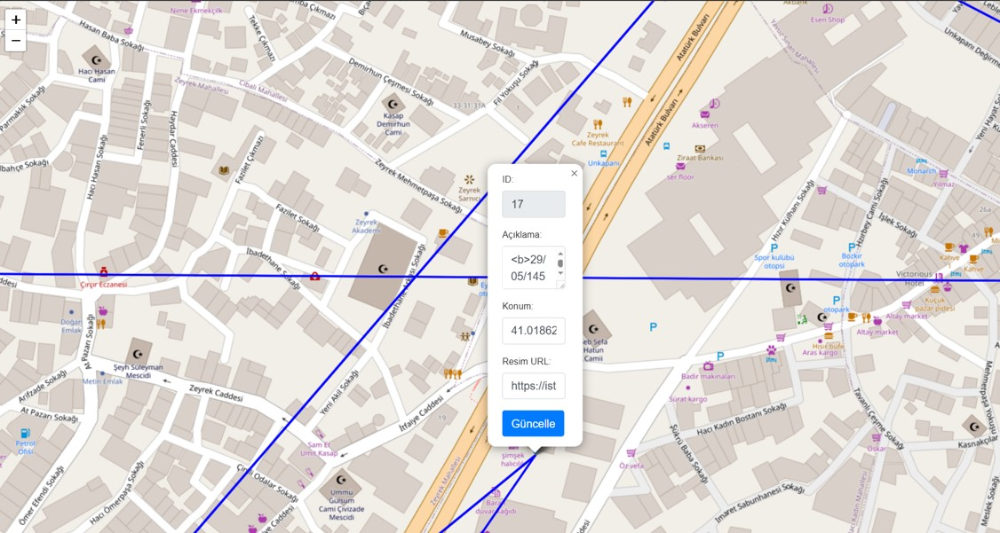
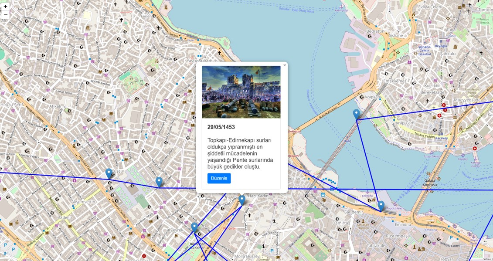

---

## 📌 About the Project

This project is a web application that visualizes a historical process step-by-step using a graph structure.
Each real-world location is represented as a node, and when clicked, an information box appears showing detailed content.

Through the edit button inside each information box, users can update the data, making the project a fully dynamic and interactive system.

---

## 📖 Introduction

In this project, the Fall of Constantinople, widely accepted as the event marking the end of the Middle Ages and the beginning of the Modern Age, is represented through a graph-based visualization.

The project is a conceptual demonstration and can be adapted to illustrate any historical event.

---

## 🎯 Project Goals

- Visualize a historical event using a directed graph structure 
- Improve long-term learning for students  
- Provide teachers and educators with an efficient teaching tool  

---

## 👥 Target Audience

- Primarily designed for students and teachers 
- Suitable for anyone interested in learning history 

---

## 🛠️ Technologies and Tools Used

| Technology / Tool | Purpose |
|-----------------|----------------|
| **Leaflet.js**  | Creating interactive maps and location markers |
| **Bootstrap**   | Designing popups, forms, and UI components |
| **JSON**        | Storing the dataset for the Fall of Constantinople |
| **Fetch API**   | Retrieving and updating JSON data |
| **JavaScript**  | Marker creation, popup management, and data handling |
| **Node.js + Express.js** | Building the server and handling GET/POST requests |

---

## ⭐ Features

- Step-by-step visualization of the Fall of Constantinople 
- Clickable nodes with information popups  
- Editable content for each node 
- Fully dynamic and user-centered structure 
- Visual representation of strategic movements on the map using gradient lines  

---

## 🖼️ Project Visuals

<p float="left">
  
  
  
  </p>
  
---

## ⚙️ Installation & Setup
Clone the Repository:
```bash
git clone https://github.com/OmerFarukArpa/data-visualization-with-graph-structure
```

```bash
cd harita
```

Then install the dependencies:
```bash
npm install
```

Start the project:
```bash
npm start 
```

Please go to this address in your browser:
```bash
http://localhost:3000
```

---

## 🚀 How It Works

1. Start the application.
2. Navigate to the first node and click on it.
3. View the image, historical description, and details.
4. Click the Edit button to update the information if needed.
5. Continue exploring the following nodes.

---

## 🔄 Why a Dynamic Structure?

- Text content can be rewritten or improved.
- Misplaced location data can be corrected.
- Visual assets can be updated or replaced.

---
